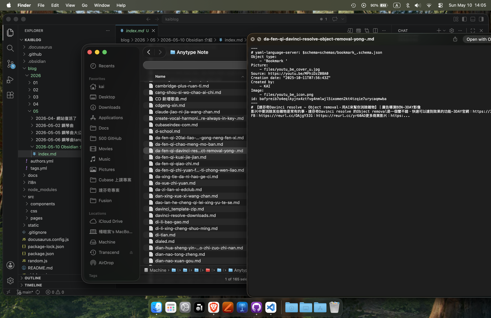

## 前言

在之前我一直都是使用 Anytype ，其實我是有接觸過 `Notion` 啦，但是老實說：`Notion` 的速度是真的超慢，網路弱的時候靈感都跑光了

後來用 Anytype 用了一年，**我才意識到一個問題：AI**
{/* truncate */}

### 聲明
:::danger 業配說明
利益相關聲明：

為了使**讀者**更好的判斷內容，不論KAI是否認為其內容獨立於贊助商，發布時都會披露利益相關情況。
#### 【本文章無利益相關。】
:::

是的，你沒看錯!從[這篇文章](/blog/house-yt01)開始，我就沒有任何的利益，單純只是分享，想讓更多人看見 這個軟體

## 為什麼要轉換到 Obsidian

如果你有在關注我 Docs 裡面的文章的話，會發現我最近新增了新區域： **Vibe coding 工具箱**！這不是業配，只是剛剛好看到，於是後來我都直接使用 `Obsidian` 嘗試做筆記，被我找到幾個優點
### 1. 介面簡單
就像是給你隨便輸入筆記一樣的簡單，不用思考要什麼。支援 MarkDown 隨心所欲的使用 粗體字大標題等
### 2. MarkDown 語法
就是因為使用 MarkDown 語法，所以 **匯出資料時不用擔心有檔名全部變成英文的問題**
> Anytype 就有...要手動一個一個改[^1] 

### 3. 支持 AI 擴充軟體
你可以自己寫專屬於你的軟體，把整個 Obsidian 變成自己的工作流！
自動化在 `Obsidian` 是挺好用的，可以去看看 `三稜鏡 Prizm` 提供的 [Vibe-coding 工具包](/docs/vibecoding/index)

接著是我使用下來的幾個缺點
### 1. 同步
如果你不介意資料放在 `Google Drive` 呃我是很介意！！！
所以目前我就是放在 `GitHub`，並且設定成 **Private(私人的)**。但是**設定麻煩而且手機同步很...**

### 2. 功能複雜

這部分可以忽略，但是我還是想抱怨一下：超多功能，你甚至還可以直接在裡面製作心智圖！我光做筆記就沒空了，還要做心智圖？？🤣

### 會想換回去 Anytype 嗎?

經過了一週的測試，我還是會想繼續使用！因為真的很好用，用了之後，感覺我會更願意去做筆記不排斥了。~~除了同步真的超麻煩的~~

[^1]: **我得一個一個修改😭** 
